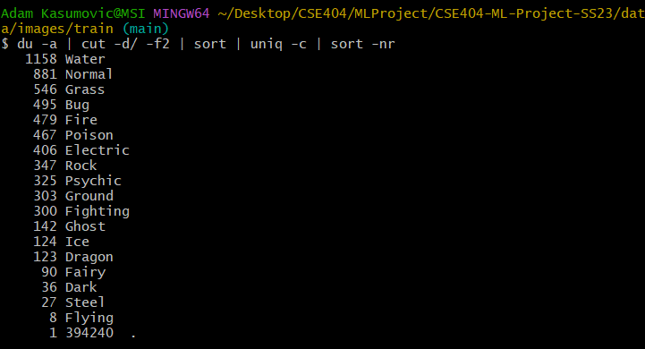
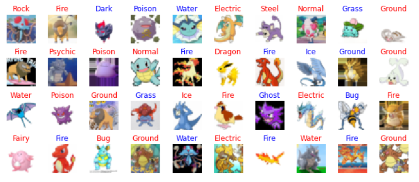
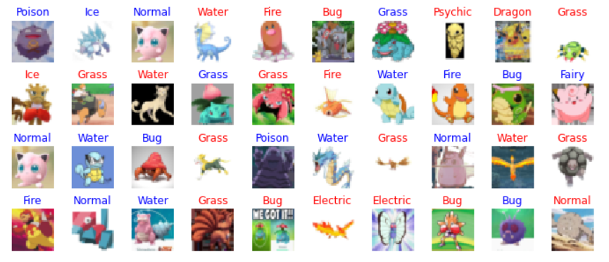
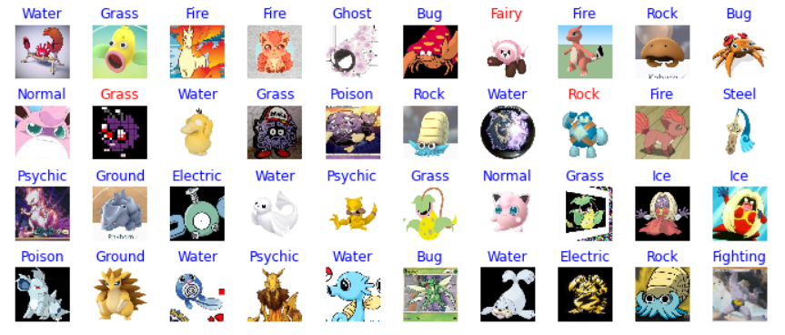

# CSE404-ML-Project-SS23: Pokemon Type Classification

Here is a demo web app that uses our model to classify pictures of [Generation I Pokemon](https://en.wikipedia.org/wiki/List_of_generation_I_Pok%C3%A9mon).

[https://pokemon-fa7zab3wva-ue.a.run.app](https://pokemon-fa7zab3wva-ue.a.run.app)

The report summary for Step 5 is at the bottom of this README.

This repository houses all code, data, and results related to Group 5's CSE 404 ML Project.

The data includes the 
[popular Kaggle Pokemon](https://www.kaggle.com/datasets/abcsds/pokemon) dataset, although it was manually improved to have the remaining Pokemon stats from Bulbapedia as well as cleaned of erroneous types.

Pokemon images were scraped from [PokemonDB's pokedex](https://pokemondb.net/pokedex/national).
Many more additional Pokemon images (all from Generation I) were downloaded from a [Kaggle dataset](https://www.kaggle.com/datasets/lantian773030/pokemonclassification).

Image data organizing was performed using Python scripts in the *utils* folder.

## Required Technologies

<ul>
    <li>
        Python 3.7+ w/ Pip
    </li>
    <li>
        Anaconda for Jupyter Notebooks
    </li>
    <li>
        Bash or *NIX environment for running Shell scripts and Git.
    </li>
    <li>
        A CUDA-enabled GPU and a version of Pytorch such that CUDA is enabled in it and the GPU will be used for models.
    </li>
</ul>

Required Python packages are included in requirements.txt. Install them with:
```angular2html
pip -r requirements.txt
```

Note that some packages might be missing since different version were required for each of us
depending on our GPU hardware. The notebook should tell you what you're missing. 

Annoyingly, pip
will try install the cpu-version of Pytorch by default. Be aware of this.

## Getting Started

Launch the Jupyter Notebook and get to work! Please try to keep all the required Python packages in requirements.txt. Here is an example (you can omit the "==..." to just install the newest version). 


## Report Summary
There are five of us on the team, and consequently there are five models. They are:

**Using Pokemon stats:**
1. Decision Tree Classifier
2. SVM

**Using Pokemon images:**

3. MLP
4. CNN
5. Resnet152

Coincidentally, the test accuracies of these five models increases in this order, i.e. 
Decision Tree Classifier had the lowest accuracy, Resnet152 had the highest accuracy, CNN had the second highest accuracy, etc.

**All train and test results are comprehensively reported in the Jupyter notebook following the training of the model.**

Due to our small data size (~1008 data points) for Pokemon stats, we opted to use *GridSearchCV* from
*scikit-learn* instead of a validation set to tune our hyperparameters. Even using the best hyperparameters,
the stats of Pokemon did poor in classifying its type. We suspect that stats are not expressive enough for classifying type,
and we are aware from our knowledge of Pokemon that so many Pokemon do not follow the stat "trends" for their type, or have
some secondary type or ability that skews their stats in a different direction.

For image classification, we initially started out with 1008 images, one for each Pokemon, and then tried to use GAN to generate
more. GAN did a very bad job doing so, but then we remembered that there is an entire internet of Pokemon images,
so we increased our dataset to about 7800 images using an additional Pokemon image dataset, which had multiple images of the same Pokemon. Here was the resulting class distribution:



This class distribution turned out to be problematic, since everything was being classified as Water, the most common class label.
However, using a *WeightedRandomSampler* on our image *DataLoaders* fixed this nicely.

Performing any form of validation on the image classifying models was met with very long training times (on the order of days), so we opted
to settle for Resnet152's incredible train and test performance. Upon seeing what our Resnet152 model (which is included in
*outputs/* as a Python Pickle file) classifies incorrectly, most of the time we understand why. For instance, a Pokemon might be shaped like a rock
but not be a Rock type, or there might be a tree in the background of the image, causing an erroneous Grass type classification. 

**Again, more comprehensive results are in the Jupyter notebook, but accuracies are put here for convenience.**

**Decision tree:**

*Train:* 98%

*Test:* 24%

**SVM:**

*Train:* 36%

*Test:* 28%

_In the following random test set Pokemon images, blue is correct and red is incorrect classification._

**MLP:**



*Train:* 55%

*Test:* 37%

**CNN:**



*Train:* 69%

*Test:* 50%

**Resnet152:**



*Train:* 100%

*Test:* 88%
